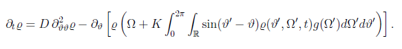
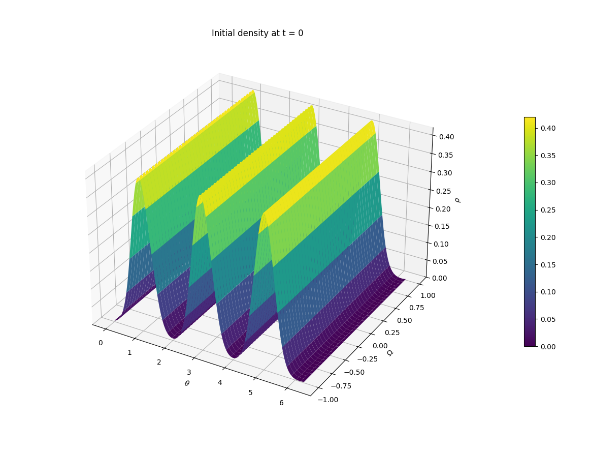
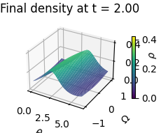
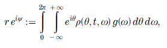

# First-order Kuramoto Model Simulator

This project is a numerical simulator for the first order, mean field Kuramoto PDE 

<p align="center">
  
</p>

---
## Model

The equation describes the evolution of the density function,  with:

- θ : phase variable
- t : time variable
- D : noise coefficient
- Ω : natural frequency  
- g(Ω) : natural frequency distribution
- K : coupling strength  

---
##  Description

The simulator allows the user to:
- compute numerical simulations of the Kuramoto dynamics
- compute phase synchronization dependence on the coupling constant K
- save simulation results for post processing and visualization
- data visualization of the results
---

---
## Numerical simulation

The user can specify a configuration (final time, noise level, coupling constant, 
initial condition, natural frequency distribution), and simulate the evolution of the density.

<div style="display: flex; justify-content: space-between; padding: 0 40px;">
  
  
</div>

---
## Phase synchronization dependence on K

The user can specify a configuration (noise level, initial condition, natural frequency distribution


## Data visualization

The simulation produces the solution of the PDE that can be used to visualize:
- density evolution
- evolution of the order parameter r(t) 

<p align="center">
  
</p>


---

##  How to build and run

###  Requirements

- C++ compiler (e.g. `g++`, `clang++`, MSVC)
- CMake (>= 3.10)
- Python >= 3.8 with numpy and matplotlib

---

###  Build

Clone the repository:

```bash
git clone https://github.com/giulioPecorella98/First-order-Kuramoto-1.git
```

Set building directories:

```bash
cd First-order-Kuramoto-1
mkdir build
cd build
```

On Linux systems:
```bash
cmake ..
cmake --build .
```

On Windows, you need to specify a generator (e.g. MinGW):

```bash
cmake -G "MinGW Makefiles" ..
cmake --build .
```


Run the python script main.py.


---


## Notes

This is a numerical implementation for research/educational purposes.
